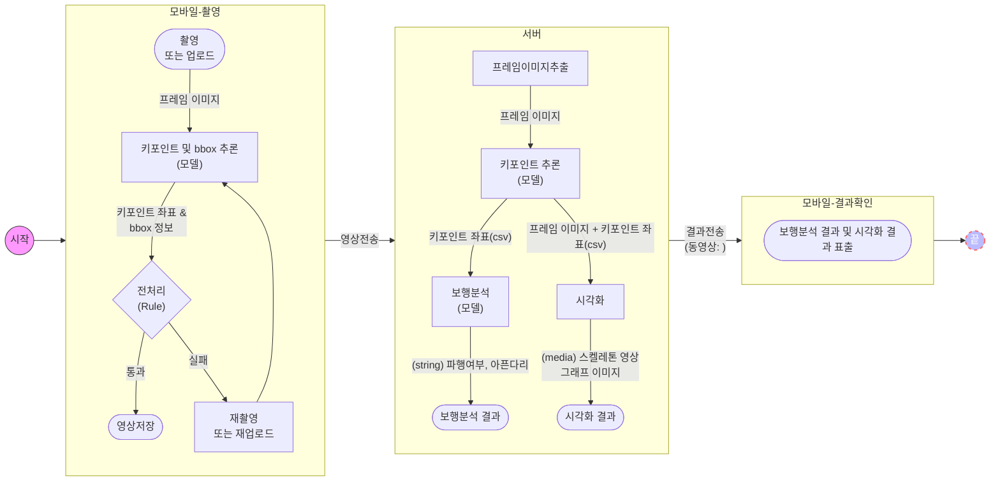

```mermaid
flowchart LR
  A0((시작))
  A1(["촬영<br>또는 업로드"])
  A2["키포인트 및 bbox 추론<br>(모델)"]
  A3{"전처리<br>(Rule)"}
  A4(["영상저장"])  
  A5[재촬영<br>또는 재업로드]  
  B1[프레임이미지추출]
  B2["키포인트 추론<br>(모델)"]  
  A3{"전처리<br>(Rule)"}
  B4["보행분석<br>(모델)"]  
  B5["시각화"]    
  B6(["보행분석 결과"])
  B7(["시각화 결과"])      
  C1(["보행분석 결과 및 시각화 결과 표출"])    
  ZO((끝))
  
  subgraph 모바일-촬영
    direction TB
        A1 --프레임 이미지--> A2
        A2 --키포인트 좌표 & <br> bbox 정보--> A3
        A3 --통과--> A4
        A3 --실패--> A5        
        A5 --> A2
  end
  subgraph 서버
    direction TB
        direction TB
        B1 --프레임 이미지--> B2
        B2 --키포인트 좌표(csv)--> B4
        B2 --프레임 이미지 + 키포인트 좌표(csv)--> B5
        B4 --(string) 파행여부, 아픈다리-->B6
        B5 --(media) 스켈레톤 영상 <br> 그래프 이미지--> B7 

  end
  subgraph 모바일-결과확인
    direction TB
        direction TB
        C1       
  end
  
A0 --> 모바일-촬영 --영상전송--> 서버 --"결과전송<br>(동영상: )"--> 모바일-결과확인 --> ZO


style A0 fill:#f9f,stroke:#333,stroke-width:1px
style ZO fill:#bbf,stroke:#f66,stroke-width:2px,color:#fff,stroke-dasharray: 5
```
